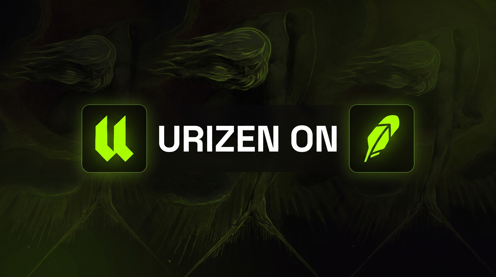
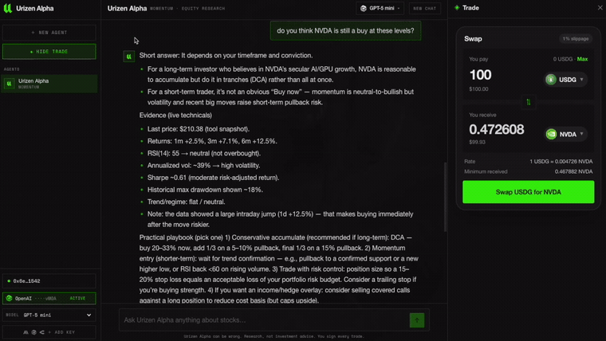
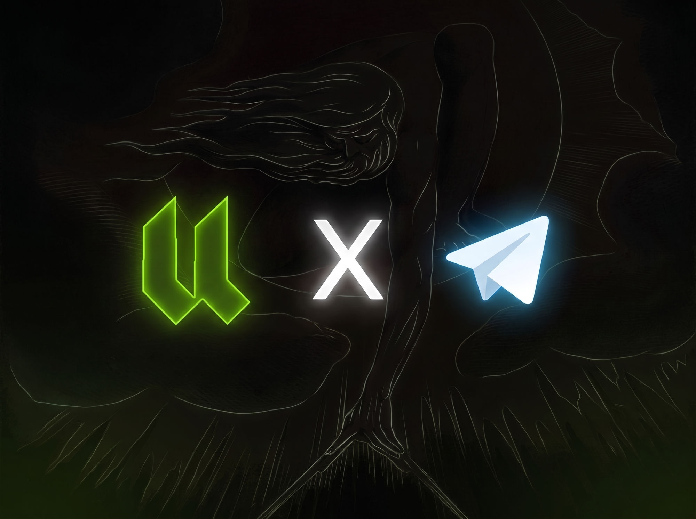

  

<h1 align="center">URIZEN</h1>

  <b>The first autonomous AI equity fund + research desk on Robinhood Chain.</b> 
  Research, analyze, and trade tokenized equities on-chain — non-custodial.

  <a href="https://urizenfund.com">urizenfund.com</a> ·
  <a href="https://urizenfund.com/alpha">Urizen Alpha</a> ·
  <a href="https://t.me/urizenthebot">Telegram bot</a>

---

Urizen measures the market and binds its chaos into order. It is a live autonomous fund and an
AI equity-research desk, built on **Robinhood Chain** (id `4663`), where tokenized US stocks and ETFs
trade on-chain against the real companies — NVDA, the Mag 7, SPY/QQQ and more.

Everything is grounded in **real data** — technicals, SEC filings, analyst consensus, macro releases,
Polymarket odds and on-chain flow. Nothing invented.

## ◈ Urizen Alpha — the research desk

  

An AI equity-research agent in the browser. Ask it anything:

- **Charts + technicals** — RSI, momentum, volatility regime, key levels
- **Fundamentals & filings** — SEC financials, insider activity, analyst ratings
- **Macro & odds** — the economic calendar, rates, and live Polymarket probabilities
- **Strategies** — build bounded, auditable, exportable trading strategies
- **Trade** — non-custodial: the agent proposes, you sign in your own wallet

Bring your own model key — it stays encrypted in your browser and is sent only to your provider,
never to a Urizen server.

## Skills

The full research toolbelt — invoke any of it in the app or the bot (`/` commands):

**Markets & technicals**
- `chart` — price chart + technicals (RSI, momentum, volatility regime, Sharpe, trend, key levels)
- `stats` — a full technical read on a name
- `screen` — rank the entire tokenized-stock universe
- `compare` — two names side by side
- `market` — the pulse: indices, VIX, rates
- `onchain` — live on-chain price + liquidity

**Fundamentals & sentiment**
- `fundamentals` — SEC financials (revenue, margins, EPS)
- `filings` — recent SEC filings + insider activity
- `ratings` — analyst consensus
- `news` — the latest headlines
- `macro` — Fed / CPI + the economic calendar
- `odds` — live Polymarket prediction-market probabilities

**Build & trade**
- `strategy` — build bounded, auditable, exportable trading strategies
- `image` — generate on-brand images
- non-custodial **swaps** — the agent proposes, you sign in your own wallet

## Telegram

  

The full desk in your pocket — [**@urizenthebot**](https://t.me/urizenthebot):

- Connect any AI provider (OpenRouter, OpenAI, Gemini, xAI, Groq, DeepSeek) — your key, your usage
- Charts, filings, macro, screeners, strategies and non-custodial swaps, all in chat
- A daily market brief and live on-chain trade alerts in the channel

## The fund

An autonomous, non-custodial book on Robinhood Chain. Bankr fees fund a reflexive flywheel — the
agents seed and manage a CASHCAT/SPCX Uniswap v4 LP, capture the volume, and use the profits to buy
back **$URI**. Every position, fill and pool is on-chain and verifiable.

## Stack

Next.js · Robinhood Chain (Uniswap v4) · wagmi / RainbowKit · Rialto best-execution routing ·
keyless data (Yahoo, SEC EDGAR, DexScreener, GeckoTerminal, Blockscout, ForexFactory, Polymarket).

---

<i>The ledger opens. Measure well.</i>

